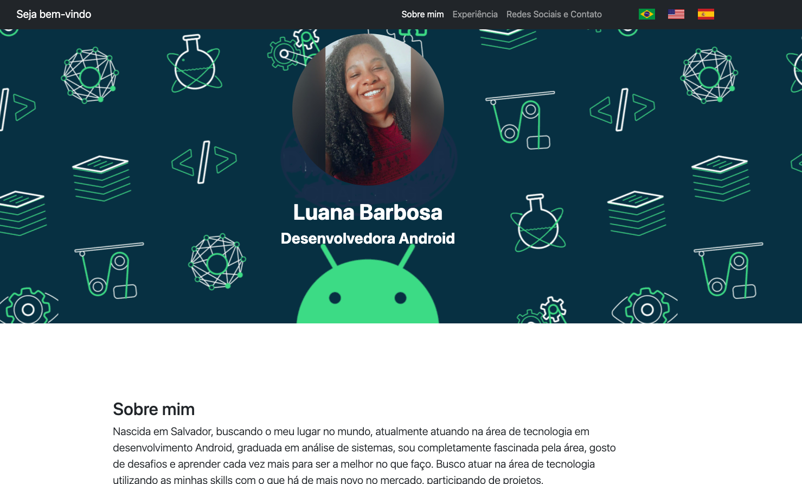

# Projeto: Página Pessoal utilizando BootStrap
Este projeto é uma página pessoal, construída com HTML, CSS e JavaScript. A página inclui informações sobre a experiência profissional, habilidades e contatos. 
A funcionalidade de tradução foi implementada usando `i18next` e `jquery-i18next` para suportar múltiplos idiomas (Português, Inglês e Espanhol).
## Funcionalidades
- Barra de navegação fixa no topo da página
- Tradução de conteúdo para Português, Inglês e Espanhol
- Seções detalhadas sobre experiência profissional, habilidades e contatos
- Ícones sociais e de ferramentas usando Font Awesome
- Responsividade com Bootstrap
## Estrutura do Projeto
- **index.html**: Página principal com o conteúdo HTML.
- **css/styles.css**: Arquivo CSS com estilos personalizados.
- **img/**: Diretório contendo as imagens utilizadas (bandeiras, perfil, etc.).
## Tecnologias Utilizadas
- HTML5
- CSS3
- JavaScript
- Bootstrap
- Font Awesome
- i18next
- jQuery
- jquery-i18next
## Como Utilizar
### Passo 1: Clonar o Repositório
```bash
git clone https://github.com/seu-usuario/seu-repositorio.git
```
### Passo 2: Estrutura de Diretórios
Certifique-se de que a estrutura de diretórios está da seguinte forma:
```
seu-repositorio/
├── css/
│   └── styles.css
├── img/
│   ├── 2-bandeira-do-brasil.webp
│   ├── bandeira-estados-unidos.webp
│   ├── bandeira-da-espanha.webp
│   └── profile.jpeg
├── index.html
└── assets/
    └── favicon.ico
```
### Passo 3: Abrir o Arquivo HTML
Abra o arquivo `index.html` em um navegador web.

## Contribuições
Contribuições são bem-vindas! Sinta-se à vontade para abrir issues e enviar pull requests.
## Licença
Este projeto está licenciado sob a [Licença MIT](LICENSE).
---
Este README fornece uma visão geral do projeto, incluindo instruções sobre como clonar e executar o projeto, 
bem como uma visão geral das tecnologias utilizadas e da estrutura do código. 
Sinta-se à vontade para adaptar este modelo conforme necessário para atender às suas necessidades específicas.
